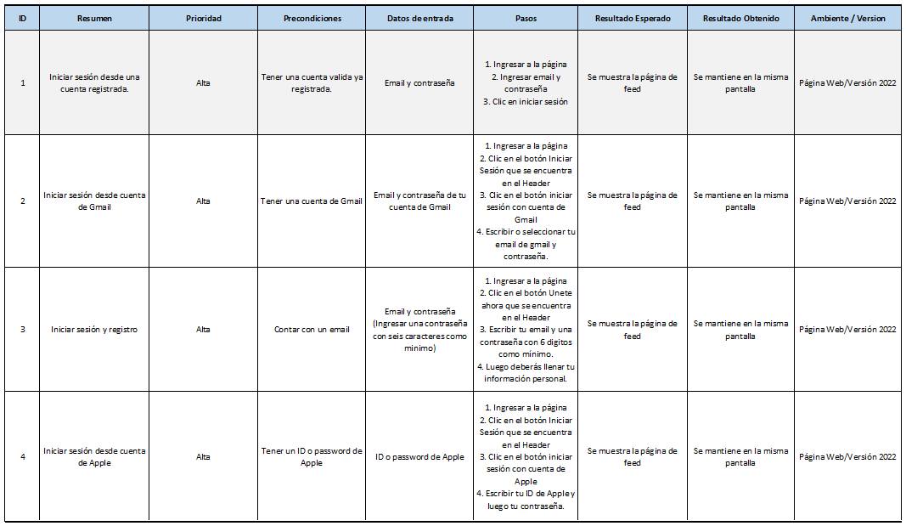

# Test
Caso de Prueba Ingreso a LinkedIn										
									

Punto de Mejora:
- Implementar otros tipos de inicio de sesión
- Establecer reglas para que los usuarios puedan tener una contraseña segura.
- Incluyendo mensajes como: * Debe ingresar una contraseña que contenga caracteres, mayúsculas, etc.

Prueba de Automatización:
Caso Amazon

Puntos de Mejora para una siguiente versión:
- Al ingresar la busqueda de la palabra "zapatillas" en español no se producia una busqueda exacta
puesto que el buscador de Amazon reconoco palabras en inglés, es por está razón que la búsqueda se
realizó con la palabra "sneakers" a su vez, al problar con la palabra "zapatillas" no se encontraba
la marca "Adidas" para selección y cuando se ingreso la palabra "sneakers" si se encontró la marca
correspondiente.
- Como mejora pertinente se deberia implementar un buscador en más idiomas según el cliente que
ingresa su idioma.
- En cuanto a los filtros estos se encuentran desordenados y con faltas ortográficas.